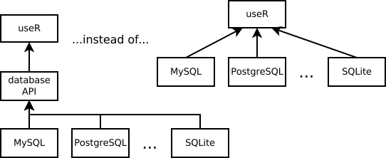
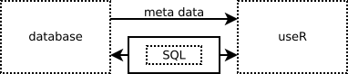
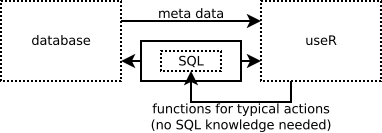
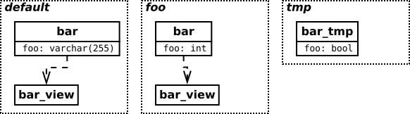
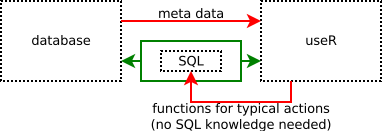

## Introduction

This will be a talk about a **common** interface for SQL database access in R

- Why do we need such an interface
- How it is implemented in R
- What are the main problems
- How we can solve this problems

## What are database interfaces for?

- They make our life <span class="green">easier</span>
    - By providing <span class="green">one API</span>  for many database vendors



## SQL database interface

Interface for an SQL database is a bit specific

- there is already a common interface for data manipulation - **SQL**
- we still need
    - a common *transport layer* for executing **SQL**
    - an interface for gathering metadata



## R SQL database interface

- It would be helpfull to be able to **avoid SQL** in typical scenarios



> - One can argue that such functions should be moved to a higher level interface
    
## Theory

The **DBI** package released in December 2001

- **SQL transport** functions: *dbSendQuery(), dbGetQuery()*
- metadata functions: *dbListTables(), dbListFields(), ...*
- higher level functions: *dbReadTable(), dbWriteTable()*

**DBI** implementations (drivers) exist for various vendors:

- MonetDB, MySQL, Oracle, PostgreSQL, SQLite, JDBC, Ms SQL Server, HSQL

## Practice - a simple database {.smaller}



<pre class="prettyprint">
CREATE TABLE bar (foo varchar(255));
CREATE SCHEMA foo;
CREATE TABLE foo.bar (foo int);
CREATE TEMPORARY TABLE bar_tmp (foo bool);
CREATE VIEW bar_view AS SELECT foo FROM bar;
CREATE VIEW foo.bar_view AS SELECT foo FROM foo.bar;
    
INSERT INTO bar VALUES ('a'), ('b');
INSERT INTO foo.bar VALUES (1), (2);
INSERT INTO bar_tmp VALUES (true), (false);
</pre>

## What do we expect? dbGetQuery()

<div class="columns-2">
<pre class="prettyprint">
SELECT * FROM bar;
SELECT * FROM bar_view;
</pre>
    ##   foo
    ## 1   a
    ## 2   b

<pre class="prettyprint">
SELECT * FROM foo.bar;
SELECT * FROM foo.bar_view;
</pre>
    ##   foo
    ## 1   1
    ## 2   2

<pre class="prettyprint">
SELECT * FROM bar_tmp;
</pre>
    # foo
    # TRUE
    # FALSE
<br/><br/><br/><br/><br/><br/>
</div>

<div class="green">Met in all tested DBI implementations</div>

## What do we expect? dbReadTable() (1/2)

<div class="columns-2">
<pre class="prettyprint lang-r">
dbReadTable('bar')
</pre>
    ##   foo
    ## 1   a
    ## 2   b
    
<div class="green">Met in all tested DBI implementations<br/><br/></div>

<pre class="prettyprint lang-r">
dbReadTable('bar_view')
</pre>
    ##   foo
    ## 1   a
    ## 2   b

<div class="green">Met in all tested DBI implementations</div>
<span class="small">(but see *dbListTables()*)</span>
</div>

## What do we expect? dbReadTable() (2/2) {.smaller .build}

How to read data from table *bar* in schema *foo*

<pre class="prettyprint">
dbReadTable(conn, 'bar', schema = 'foo') # Oracle
    
dbReadTable(conn, c('foo', 'bar')) # PostgreSQL

dbReadTable(conn, 'foo.bar') # JDBC, MySQL, SQLite
  # no identifier escaping! try e.g. dbReadTable(conn, 'foo.bar, bar')
</pre>    

    ##   foo
    ## 1   1
    ## 2   2


- <span class="green">Works in most implementations (except MonetDb)</span>

- <span class="red">But works **differently** in different implementations</red>

## What do we expect? dbListTables() {.smaller .build}

<div class="columns-2">
Maybe a data frame?

```{r, echo = FALSE}
data.frame(schema = c('public', 'public', 'foo', 'foo', 'tmp'), name = c('bar', 'bar_view', 'bar', 'bar_view', 'bar'), type = c('table', 'view', 'table', 'view', 'table'))
```

Maybe just a vector?
```{r echo = FALSE}
c('bar', 'bar_view', 'foo.bar', 'foo.bar_view', 'tmp.bar')
```

<br/>
<br/>
</div>

In practice we always get a character vector, but:

- <span class="red">without any information on the schema</span>
- <span class="red">the number of elements varies a lot between implementations</span>

<div class="columns-2">
    PostgreSQL  
    ## [1] "bar" "bar" "bar_tmp"
    
    MySQL  
    ## [1] "bar" "bar_view"
</div>    
    JDBC to PostgreSQL  
    ## [1] "bar" "bar" "bar_view" "var_view" "bar_tmp" (and 200+ others) 

## What do we expect? minor issues

There are other minor differences between DBI implementations:

> - *RPostgreSQL*
    - does not respect client encoding
    - throws an error if query produces any notice on the server side  
      (e.g. you can not replace view if it exists)
> - In *RJDBC* dbSendQuery() throws an error saying that no data have been returned
    - while returning no data is an expected behaviour
    - the query itself is executed despite the error
<br/><br/>
> - Probably many more...

## Conclusion

- The *transport layer* for SQL queries <span class="green">works as expected</span>
    - except for some minor issues in some implementations

> - But gathering metadata and *no SQL* data manipulation functions are strongly <span class="red">implementation specific</span>  
    - we can not use them smoothly in higher level packages
    - <span class="red">although we already do so...</span>  
      (see the reverse dependency list of the DBI package)



## How to overcome problems 1/2 {.build}

Provide a much more <span class="green">detailed specification</span> of the DBI interface

It should be directly stated:

- how to handle schemas
- how to treat views 
- how to treat temporary tables / temporary views
- if a DBI driver is responsible for data encoding or not
- standards that should be followed
    - e.g. identifiers escaping
- etc.

## How to overcome problems 2/2
    
Provide a set of <span class="green">tests</span> for DBI implementation creators/mainteners

> - as R is extremally dynamically typed  
  there is no good way to statically check  
  if an implementation meets the DBI interface
<br/><br/>
> - allow us to check returned results
<br/><br/>
> - allow us to check for basic security flaws
<br/><br/>
> - it is an easy and straightforward solution 
    - a draft of such tests was written to prepare this presentation

## Appendix - Parameterized queries

Parameterized queries (prepared statements)

- more effective and more safe then *ordinary* queries
    - see [a vignette of the RODBCext package](https://github.com/zozlak/RODBCext/blob/master/vignettes/Parameterized_SQL_queries.Rmd)
- not as natural as in other languages  
  due to R's *copy on assigment*
    - yet still very useful

- totally missed in the DBI    

##

<h2 class="end">Thank you for your attention</h2>
zozlak@zozlak.org
